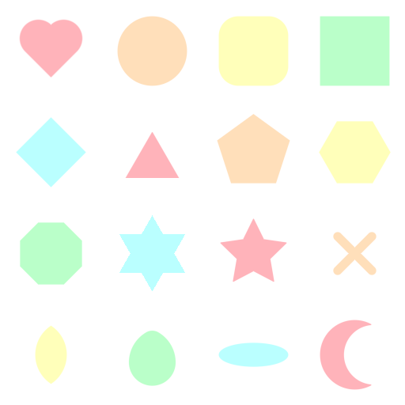
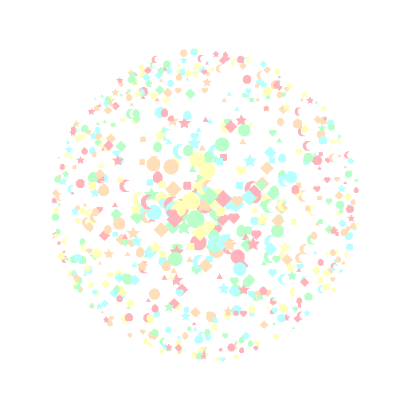

# sdf2d

2d SDF shader functions by Inigo Quilez, ported to C.

https://iquilezles.org/articles/distfunctions2d/

To build, run "make", then "./demo" to run the demo.

The demo will produce 2 PPM files: "demo.ppm" and
"sprinkles.ppm".
